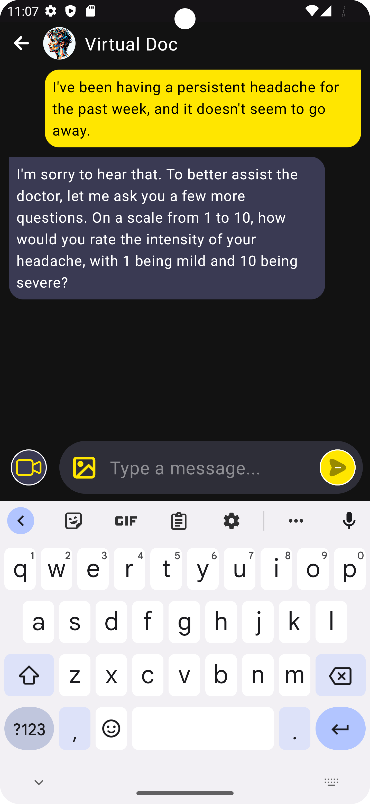
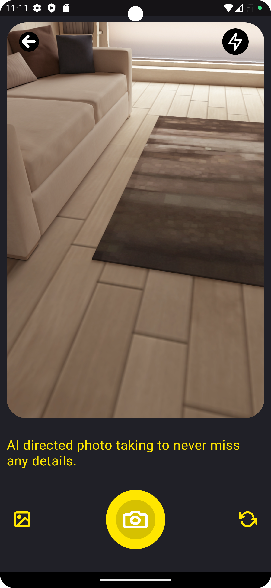
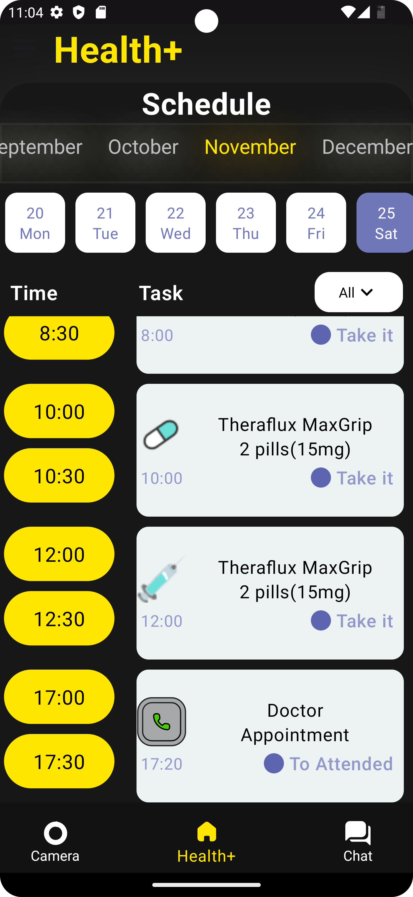

# Neural Ninja App: AI Health Assistant App

The AI Health Assistant App is an Android application that allows patients to interact with an AI-powered chat system to describe their health issues. The AI, in collaboration with real doctors, generates prescriptions based on the information provided by the users.

## Inspirational Repositories
The image and chat functionality and user interaction design were inspired by the various open-source projects.

1. **Skin GPT-4**
   - You can find their repository [here](https://github.com/JoshuaChou2018/SkinGPT-4).

2. **MEDAGI**
   - Check out their work [here](https://github.com/JoshuaChou2018/MedAGI).
     
3. **XrayChat**
   - Check them out [here](https://github.com/UCSD-AI4H/XrayChat)


## Features

- **Chat Interface**: Users can communicate with the AI using a chat-based interface to describe their health concerns.



- **AI-Powered Analysis**: The AI system uses natural language processing to understand user inputs and generate preliminary health assessments.


- **Collaboration with Real Doctors**: The AI works in conjunction with real doctors to ensure the prescriptions are accurate and reliable.

- **Prescription Generation**: Based on the user's input and AI analysis, a prescription is generated, taking into account the medical expertise of real doctors.


## Getting Started

### Prerequisites

- Android Studio: The app is developed using Android Studio, so make sure you have it installed.

### Installation

1. Clone the repository:

   ```bash
   git clone https://github.com/arvindri2005/Neural-Ninjas-App.git
